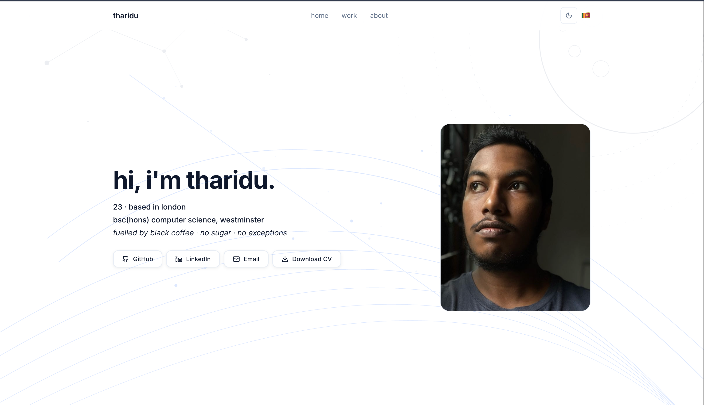

# tharidu.dev

Personal portfolio website built with React, TypeScript, and Vite.

Live at **[tharidu.dev](https://tharidu.dev)**

---

---

## Stack

- **Framework:** React 18 + Vite
- **Language:** TypeScript
- **Styling:** Inline styles with CSS custom properties
- **Icons:** Lucide React
- **Routing:** React Router v6
- **Deployment:** Vercel

---

## Features

- Light and dark theme toggle
- 🇱🇰 Sinhala greeting easter egg
- Interactive SVG background — moon, constellation, guitar strings, light beam
- Scroll progress indicator
- Project screenshots with lightbox
- Diacify and SKY Engineering case study pages
- Build log modal (`v1.0` in footer)
- Responsive down to 375px
---
## Background SVG

The background pattern is hand-crafted SVG with personal meaning:

- **Crescent moon** — "tharidu" means *the moon* in Sinhala
- **Guitar string arcs** — fingerpicking guitar is a hobby
- **Constellation** — inspired by Sri Lankan music and Harry Potter astronomy
- **Light beam** — Expecto Patronum / Goggins energy

Two versions: `LightSVG.tsx` and `DarkSVG.tsx` swap on theme toggle.

---

## Interactions

| Trigger | Effect |
|---|---|
| Hover name in navbar | Tooltip: "තරිදු — the moon, in sinhala." |
| Click 🇱🇰 in hero | Greeting swaps to Sinhala for 2.5s |
| Hover star node | Star brightens |
| Hover guitar string | String plucks |
| Fast mouse movement | Blue particle trail |
| Hover moon area | Radial rings expand |
| Click project screenshot | Lightbox opens, background blurs |

---

## Licence

MIT — feel free to use as inspiration, but please don't copy the personal content.